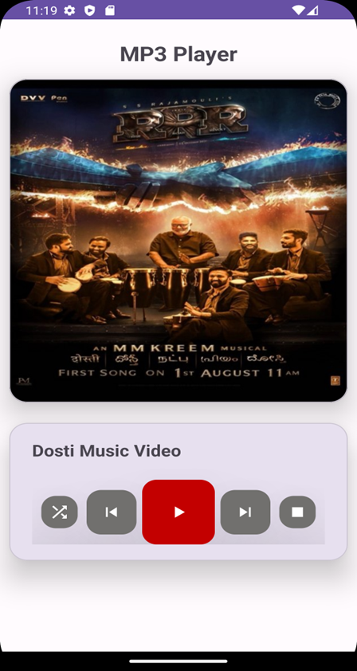

# P6_21012011046 - MP3 Player Application

Submitted By: MAKWANA SWASTIK PRAVIN

Enrollment number: 21012011046

## AIM
Create an MP3 player application using a service by following the instructions provided below.

## Instructions

### 1. Create MainActivity and Design

Design your main activity as shown in the provided image.

### activity_main.xml

```xml
<?xml version="1.0" encoding="utf-8"?>
<androidx.constraintlayout.widget.ConstraintLayout xmlns:android="http://schemas.android.com/apk/res/android"
    xmlns:app="http://schemas.android.com/apk/res-auto"
    xmlns:tools="http://schemas.android.com/tools"
    android:layout_width="match_parent"
    android:layout_height="match_parent"
    tools:context=".MainActivity">

    <androidx.constraintlayout.widget.ConstraintLayout
        android:layout_width="match_parent"
        android:layout_height="match_parent">

        <!-- Header -->
        <TextView
            android:id="@+id/textView"
            android:layout_width="wrap_content"
            android:layout_height="wrap_content"
            android:layout_marginTop="25dp"
            android:text="MP3 Player"
            android:textSize="25sp"
            android:textStyle="bold"
            app:layout_constraintEnd_toEndOf="parent"
            app:layout_constraintStart_toStartOf="parent"
            app:layout_constraintTop_toTopOf="parent" />

        <!-- Card for Album Art -->
        <com.google.android.material.card.MaterialCardView
            android:id="@+id/materialCardView"
            android:layout_width="match_parent"
            android:layout_height="400dp"
            android:layout_marginHorizontal="10dp"
            android:layout_marginTop="15dp"
            app:cardCornerRadius="20dp"
            app:cardElevation="20dp"
            app:layout_constraintStart_toStartOf="parent"
            app:layout_constraintTop_toBottomOf="@+id/textView">

            <ImageView
                android:id="@+id/imageView"
                android:layout_width="match_parent"
                android:layout_height="match_parent"
                android:scaleType="fitXY"
                app:srcCompat="@drawable/mypic" />
        </com.google.android.material.card.MaterialCardView>

        <!-- Music Controls -->
        <com.google.android.material.card.MaterialCardView
            android:layout_width="match_parent"
            android:layout_height="wrap_content"
            android:layout_marginHorizontal="10dp"
            android:layout_marginTop="25dp"
            android:padding="10dp"
            app:cardCornerRadius="20dp"
            app:cardElevation="20dp"
            app:layout_constraintStart_toStartOf="parent"
            app:layout_constraintTop_toBottomOf="@id/materialCardView">

            <androidx.constraintlayout.widget.ConstraintLayout
                android:layout_width="match_parent"
                android:layout_height="match_parent"
                android:layout_marginStart="25dp"
                android:layout_marginEnd="25dp"
                android:paddingTop="20dp"
                android:paddingBottom="20dp">

                <!-- Song Title -->
                <TextView
                    android:id="@+id/textView2"
                    android:layout_width="wrap_content"
                    android:layout_height="wrap_content"
                    android:text="Dosti Music Video"
                    android:textSize="20sp"
                    android:textStyle="bold"
                    app:layout_constraintStart_toStartOf="parent"
                    app:layout_constraintTop_toTopOf="parent" />

                <!-- Stop Button -->
                <com.google.android.material.floatingactionbutton.FloatingActionButton
                    android:id="@+id/stop_button"
                    android:layout_width="wrap_content"
                    android:layout_height="wrap_content"
                    android:layout_gravity="center"
                    android:backgroundTint="#71706E"
                    app:borderWidth="0dp"
                    app:elevation="50dp"
                    android:layout_marginTop="50dp"
                    app:fabCustomSize="40dp"
                    app:layout_constraintBottom_toBottomOf="parent"
                    app:layout_constraintEnd_toEndOf="parent"
                    app:layout_constraintHorizontal_bias="0.5"
                    app:layout_constraintStart_toEndOf="@+id/next_button"
                    app:layout_constraintTop_toTopOf="parent"
                    app:srcCompat="@drawable/baseline_stop_24"
                    app:tint="@color/white" />

                <!-- Next Button -->
                <com.google.android.material.floatingactionbutton.FloatingActionButton
                    android:id="@+id/next_button"
                    android:layout_width="wrap_content"
                    android:layout_height="wrap_content"
                    android:layout_gravity="center"
                    android:backgroundTint="#71706E"
                    app:borderWidth="0dp"
                    app:elevation="50dp"
                    app:fabCustomSize="55dp"
                    android:layout_marginTop="50dp"
                    app:layout_constraintBottom_toBottomOf="parent"
                    app:layout_constraintEnd_toStartOf="@+id/stop_button"
                    app:layout_constraintHorizontal_bias="0.5"
                    app:layout_constraintStart_toEndOf="@+id/play_button"
                    app:layout_constraintTop_toTopOf="parent"
                    app:srcCompat="@drawable/baseline_skip_next_24"
                    app:tint="@color/white" />

                <!-- Play/Pause Button -->
                <com.google.android.material.floatingactionbutton.FloatingActionButton
                    android:id="@+id/play_button"
                    android:layout_width="wrap_content"
                    android:layout_height="wrap_content"
                    android:layout_gravity="center"
                    android:backgroundTint="#c30000"
                    app:borderWidth="0dp"
                    app:elevation="50dp"
                    android:layout_marginTop="50dp"
                    app:fabCustomSize="80dp"
                    app:layout_constraintBottom_toBottomOf="parent"
                    app:layout_constraintEnd_toStartOf="@+id/next_button"
                    app:layout_constraintHorizontal_bias="0.5"
                    app:layout_constraintStart_toEndOf="@+id/previous_button"
                    app:layout_constraintTop_toTopOf="parent"
                    app:srcCompat="@drawable/baseline_play_arrow_24"
                    app:tint="@color/white" />

                <!-- Previous Button -->
                <com.google.android.material.floatingactionbutton.FloatingActionButton
                    android:id="@+id/previous_button"
                    android:layout_width="wrap_content"
                    android:layout_height="wrap_content"
                    android:layout_gravity="center"
                    android:backgroundTint="#71706E"
                    app:borderWidth="0dp"
                    app:elevation="50dp"
                    app:fabCustomSize="55dp"
                    android:layout_marginTop="50dp"
                    app:layout_constraintBottom_toBottomOf="parent"
                    app:layout_constraintEnd_toStartOf="@+id/play_button"
                    app:layout_constraintHorizontal_bias="0.5"
                    app:layout_constraintStart_toEndOf="@+id/shuffle_button"
                    app:layout_constraintTop_toTopOf="parent"
                    app:srcCompat="@drawable/baseline_skip_previous_24"
                    app:tint="@color/white" />

                <!-- Shuffle Button -->
                <com.google.android.material.floatingactionbutton.FloatingActionButton
                    android:id="@+id

/shuffle_button"
                    android:layout_width="wrap_content"
                    android:layout_height="wrap_content"
                    android:layout_gravity="center"
                    android:backgroundTint="#71706E"
                    app:borderWidth="0dp"
                    app:elevation="50dp"
                    android:layout_marginTop="50dp"
                    app:fabCustomSize="40dp"
                    app:layout_constraintBottom_toBottomOf="parent"
                    app:layout_constraintEnd_toStartOf="@+id/previous_button"
                    app:layout_constraintHorizontal_bias="0.5"
                    app:layout_constraintStart_toStartOf="parent"
                    app:layout_constraintTop_toTopOf="parent"
                    app:srcCompat="@drawable/baseline_shuffle_24"
                    app:tint="@color/white" />

            </androidx.constraintlayout.widget.ConstraintLayout>
        </com.google.android.material.card.MaterialCardView>
    </androidx.constraintlayout.widget.ConstraintLayout>
</androidx.constraintlayout.widget.ConstraintLayout>
```

### 2. Create Service Class and Implement MediaPlayer Object

Create a Service class and implement the MediaPlayer object for audio playback.

### MyService.kt

```kotlin
package com.example.practical_6_046

import android.app.Service
import android.content.Intent
import android.media.MediaPlayer
import android.os.IBinder
import android.util.Log

class MyService : Service() {
    lateinit var mediaPlayer: MediaPlayer
    val TAG = "MyService"

    override fun onBind(intent: Intent): IBinder {
        TODO("Return the communication channel to the service.")
    }

    override fun onStartCommand(intent: Intent?, flags: Int, startId: Int): Int {
        if (!this::mediaPlayer.isInitialized)
            mediaPlayer = MediaPlayer.create(this, R.raw.song)
        if (intent != null) {
            val str1: String? = intent.getStringExtra("Service1")
            if (str1 == "PlayPause") {
                if (!mediaPlayer.isPlaying)
                    mediaPlayer.start()
                else
                    mediaPlayer.pause()
                Log.i(TAG, "onStartCommand :")
            }
        } else {
            mediaPlayer.start()
        }
        return START_STICKY
    }

    override fun onDestroy() {
        mediaPlayer.stop()
        super.onDestroy()
    }
}
```

### 3. MainActivity

Create the main activity to control the MP3 player and interact with the MyService.

### MainActivity.kt

```kotlin
package com.example.practical_6_046

import android.content.Intent
import androidx.appcompat.app.AppCompatActivity
import android.os.Bundle
import com.google.android.material.floatingactionbutton.FloatingActionButton

class MainActivity : AppCompatActivity() {
    var togglePlayButton = true;

    override fun onCreate(savedInstanceState: Bundle?) {
        super.onCreate(savedInstanceState)
        setContentView(R.layout.activity_main)
        val playButton = findViewById<FloatingActionButton>(R.id.play_button)
        val stopButton = findViewById<FloatingActionButton>(R.id.stop_button)
        playButton.setOnClickListener {
            Intent(applicationContext, MyService::class.java).
            putExtra("Service1", "PlayPause").apply {
                startService(this)
            }
            if (togglePlayButton) {
                togglePlayButton = false;
                playButton.setImageResource(R.drawable.baseline_pause_24)
            } else {
                togglePlayButton = true;
                playButton.setImageResource(R.drawable.baseline_play_arrow_24)
            }
        }
        stopButton.setOnClickListener {
            Intent(applicationContext, MyService::class.java).apply {
                startService(this)
            }
            if (!togglePlayButton) {
                togglePlayButton = true;
                playButton.setImageResource(R.drawable.baseline_play_arrow_24)
            }
        }
    }
}
```

## Screenshots


